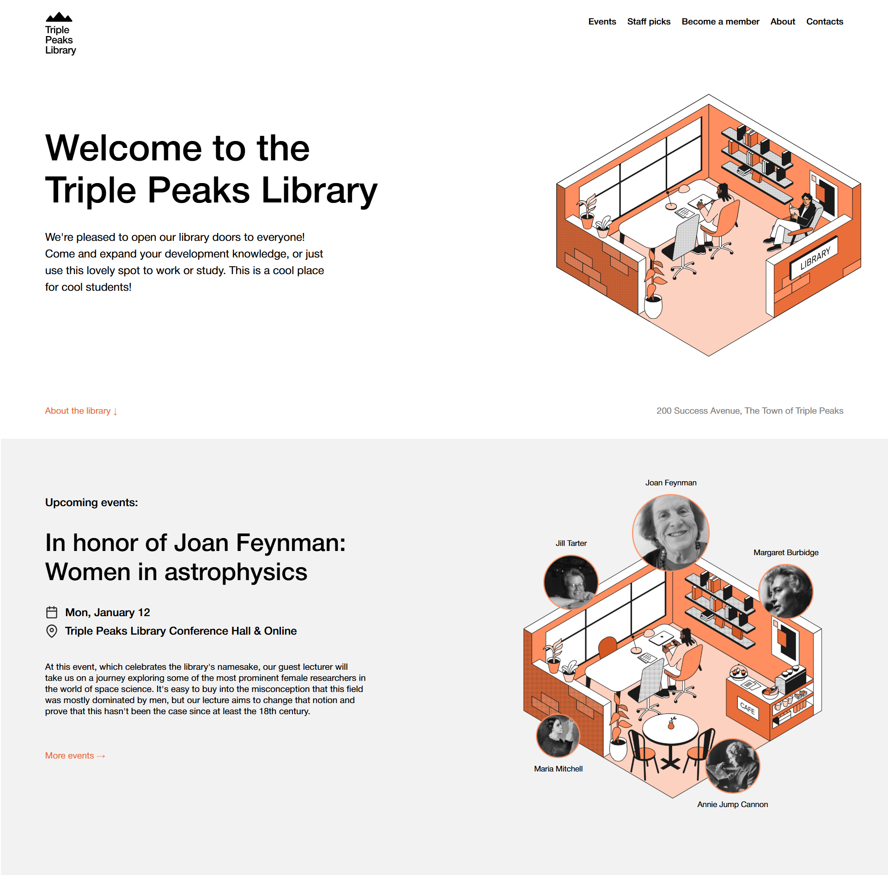
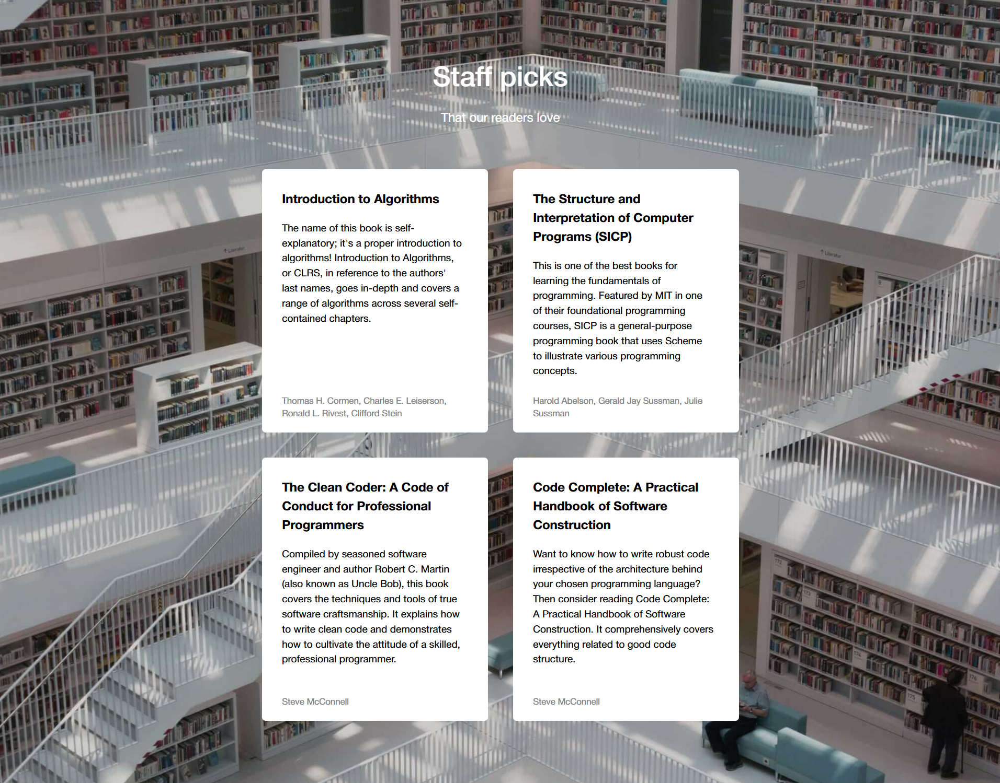
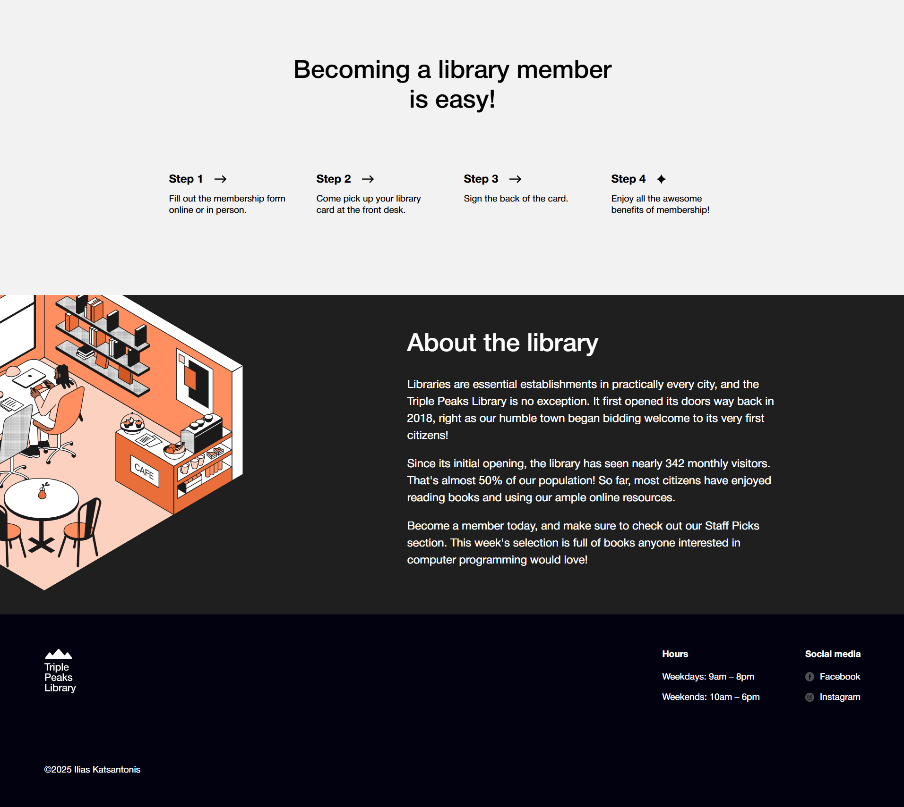

# Project 1: Triple Peaks Library

This project is a responsive landing page built with HTML and CSS as part of the TripleTen Software Engineering program.  
It demonstrates semantic HTML structure, modern CSS layout techniques, and clean page organization.

## Project features

- Semantic HTML5
- Flexbox
- Positioning
- Vertical stacking with z-index

## Images

### Homepage

### Staff Picks

### About Section

